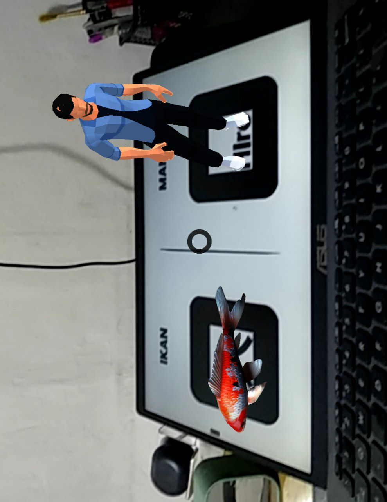
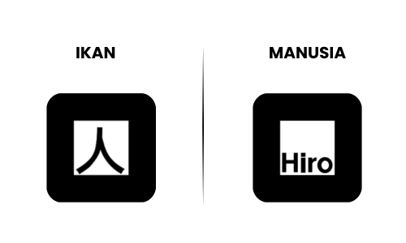

# learning-ARVR
Repo ini digunakan untuk belajar tentang ARVR dan dibuat untuk memenuhi UTS matakuliah Augmented dan Virtual Reality

## Screenshoot Aplikasi

    

## Hallo semuanya 👋
Perkenalkan saya: Cecep Rokani ([@ceceprokani](https://github.com/ceceprokani/)). Disini saya Membuat tema AR sederhana yaitu __Ikan dan Manusia__.
__Ikan dan Manusia__ merupakan sebuah aplikasi AR sederhana yang memiliki 2 Marker (__Kanji__ dan __Hiro__).
Tujuan utama dari aplikasi ini adalah __tentunya untuk proses belajar saya sekaligus sebagai tugas matakuliah Augmented dan Virtual Reality__. 

### Penggunaan Aplikasi

- Silahkan akses aplikasi bisa melalui tautan berikut ini : [Tautan Aplikasi](https://bow-coherent-walnut.glitch.me)
- Setelah aplikasi berjalan lancar, silahkan scan/arahkan kamera device pada marker dibawah ini untuk melihat 3D Model pada aplikasi

#### Marker Hiro & Kanji

    

