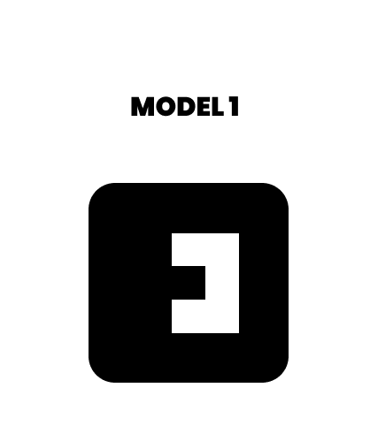
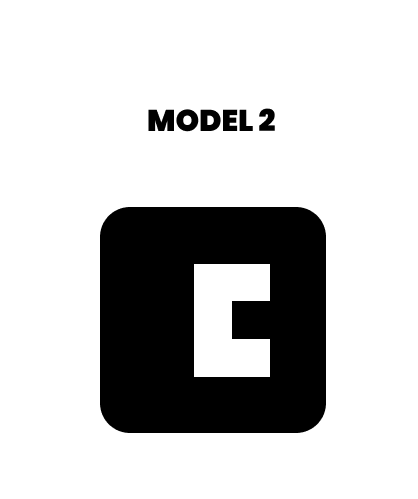
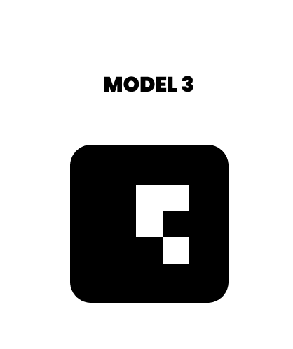
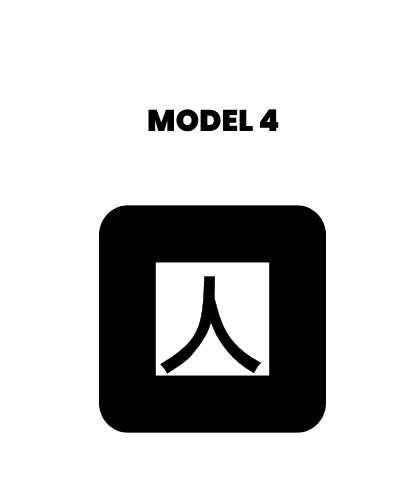
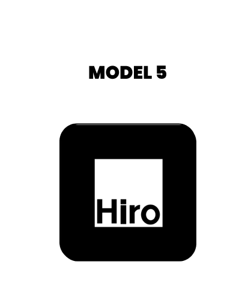

# Marker based Augmented Reality dengan ARJS
Repo ini digunakan untuk belajar tentang Marker based Augmented Reality dengan ARJS dan dibuat untuk memenuhi __Ujian Tengah Semester__ matakuliah Augmented dan Virtual Reality

## Screenshoot Aplikasi

    

## Hallo semuanya 👋
Perkenalkan saya: Cecep Rokani ([@ceceprokani](https://github.com/ceceprokani/)). Disini saya Membuat tema AR sederhana yaitu __Character Digimon__.
Untuk marker sendiri menggunakan preset default __Kanju__, __Hiro__, dan __Barcode__

### Penggunaan Aplikasi

- Silahkan akses aplikasi bisa melalui tautan berikut ini : [Tautan Aplikasi](https://ar-vr-delta.vercel.app/)
- Setelah aplikasi berjalan lancar, silahkan scan/arahkan kamera device pada marker dibawah ini untuk melihat 3D Model pada aplikasi

### Marker Digimon
__1. Semua Marker__

Berikut ini adalah daftar marker semua character digmon

    

  

__2. Marker Per Character__

Berikut ini adalah daftar marker permodel
- Model 1

    

 

- Model 2

    

 

- Model 3

    

 

- Model 4

    

 

- Model 5

    

