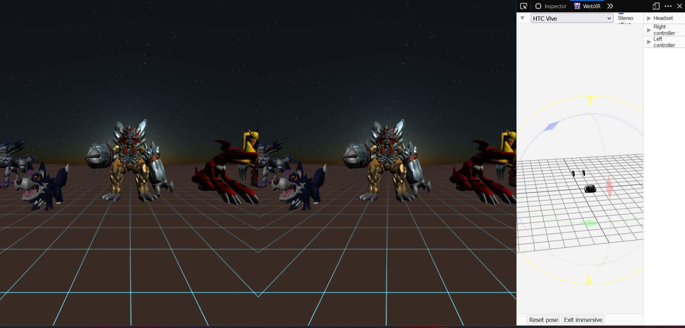

# Marker based Virtual Reality dengan AFrame
Repo ini digunakan untuk belajar tentang Virtual Reality dengan AFrame dan dibuat untuk memenuhi Tugas matakuliah Augmented dan Virtual Reality

## Screenshoot Aplikasi

    

## Hallo semuanya 👋
Perkenalkan saya: Cecep Rokani ([@ceceprokani](https://github.com/ceceprokani/)). Disini saya Membuat tema VR sederhana yaitu __Karakter Digimon__.
Tujuan utama dari aplikasi ini adalah __tentunya untuk proses belajar saya sekaligus sebagai tugas matakuliah Augmented dan Virtual Reality__. 